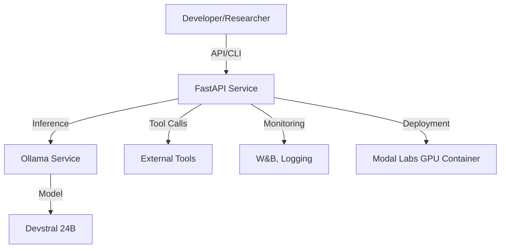

# Modal Deployments: Advanced AI Model Fine-Tuning & Deployment System

[](https://opensource.org/licenses/MIT)
[](https://www.python.org/downloads/)
[](https://modal.com/)

## Overview

This repository provides a robust, production-grade platform for fine-tuning, configuring, and deploying large language models (LLMs) using Modal Labs and Ollama. The system is optimized for the Devstral 24B model, enabling advanced code generation, tool-calling, and agentic workflows in professional development environments such as VS Code and cloud-based coding servers.

## Key Features

- **Modal Labs Integration**: Seamless cloud deployment with GPU acceleration, container orchestration, and scalable inference.
- **Ollama Model Management**: Automated model pulling, custom Modelfile creation, and service orchestration for local and remote inference.
- **Devstral 24B Optimization**: Pre-configured for high-context, low-latency coding and reasoning tasks, with LoRA and advanced fine-tuning support.
- **Tooling & API**: FastAPI-based endpoints, OpenAI-compatible chat completions, and extensible tool-calling for agentic workflows.
- **Reproducible Research**: YAML-based configuration, versioned datasets, and experiment tracking for academic and industrial research.

## Architecture



## Project Structure

```text
modal-deployments/
├── README.md
├── pyproject.toml
├── requirements.txt
├── bin/                # Executable scripts
├── config/             # YAML configs, Modelfile, systemd
├── src/
│   ├── core/           # Fine-tuning, integration, system logic
│   ├── deployment/     # Modal/Ollama deployment, API
│   ├── models/         # Model definitions/utilities
│   └── utils/          # Advanced techniques, helpers
├── tests/              # Unit, integration, e2e
├── examples/           # Usage and test scripts
├── docs/               # Setup, concepts, troubleshooting
├── setup/              # Install, quick start, requirements
├── tools/              # VS Code workspace, dev tools
├── data/               # Datasets, checkpoints
└── logs/               # Logs and monitoring
```

## Quick Start

### Prerequisites

- Python 3.11+
- Modal Labs account ([modal.com](https://modal.com))
- (Optional) Ollama installed locally for development
- Sufficient GPU/CPU resources for model deployment

### Installation

```bash
# Clone repository
git clone https://github.com/yourusername/modal-deployments.git
cd modal-deployments

# Install dependencies
pip install -r requirements.txt
# or
poetry install
```

### Configuration

- Edit `config/model_config.yaml` and `config/training_config.yaml` for model, deployment, and fine-tuning parameters.
- Ensure `config/Modelfile` and `config/ollama.service` are present and correct for your environment.
- Set up Modal Labs authentication:
  ```bash
  modal token new
  ```

### Deploy Devstral 24B with Modal Labs

```bash
modal deploy src/deployment/devstral_modal_deployment.py
```

### Local Development & Testing

```bash
python setup/quick_start.py
python examples/simple_example.py
```

## Advanced Configuration

- **Fine-Tuning**: Use `src/core/ollama_finetune_system.py` and `config/training_config.yaml` to run LoRA or full-parameter fine-tuning on reasoning and code datasets.
- **API Extension**: Extend `src/deployment/devstral_modal_deployment.py` to add new endpoints, tool integrations, or custom logic.
- **Monitoring**: Integrate with Weights & Biases (W&B) and advanced logging as configured in `config/model_config.yaml`.

## File System Tooling & Knowledge Base Integration

### File System Tooling

This platform provides agentic file system tooling, enabling the AI agent to:

- List, read, write, and modify files and directories within the workspace or a specified project root
- Perform code search, refactoring, and batch operations
- Integrate with VS Code and Modal Labs for seamless development workflows

**Implementation:**

- See `src/utils/filesystem_tools.py` for a secure, sandboxed Python utility class
- Expose file system operations as FastAPI endpoints or as callable tools for the agent
- Enforce security and sandboxing for all file operations

**Example Usage:**

```python
from src.utils.filesystem_tools import FileSystemTools

fs = FileSystemTools(root="/workspace")
print(fs.list_dir("src/"))
print(fs.read_file("README.md"))
```

### AI Knowledge Base (MCP) Integration

This system is designed to connect to an external AI Knowledge Base using the Model Context Protocol (MCP), enabling advanced context retrieval and knowledge-augmented agent workflows.

**Key Features:**

- Asynchronous, high-performance client for querying and updating the knowledge base
- Context-aware search, note retrieval, and project context extraction
- Designed for integration with Obsidian vaults or other structured knowledge systems

**Integration Steps:**

1. Clone or reference your MCP client (e.g., `obsidian_mcp_client.py` and `AIAgentKnowledgeInterface`) from:
   `/home/bzcasper/ai-projects/Knowledge_Bases/AI_Knowledge_Base/mcp/client/obsidian_mcp_client.py`
2. Add the MCP client as a dependency in your Modal deployment (e.g., in `src/deployment/devstral_modal_deployment.py`).
3. Configure the vault path and MCP server connection in your deployment or agent configuration.
4. Use the `AIAgentKnowledgeInterface` to retrieve relevant context for agent tasks, tool calls, or code generation.

**Example Usage:**

```python
from obsidian_mcp_client import AIAgentKnowledgeInterface

async def get_context(query):
    async with AIAgentKnowledgeInterface('/path/to/vault') as kb:
        context = await kb.find_relevant_context(query)
        return context
```

**Benefits:**

- Enables retrieval-augmented generation (RAG) and context-aware coding
- Supports project, documentation, and codebase search for agentic workflows
- Scalable to large, multi-project knowledge bases

---

## Academic & Professional Use

This repository is designed for advanced users, including graduate students, researchers, and professional engineers. The codebase emphasizes reproducibility, modularity, and extensibility for experimentation and production deployment.

- **Reproducible Experiments**: All configurations are YAML-based and version-controlled.
- **Scalable Deployment**: Modal Labs enables rapid scaling from local prototyping to cloud production.
- **Security & Compliance**: Follows best practices for dependency management, code quality, and operational security.

## Documentation

- [docs/SETUP_GUIDE.md](docs/SETUP_GUIDE.md): Detailed setup and deployment instructions
- [docs/CONCEPTS.md](docs/CONCEPTS.md): In-depth explanations of LLM fine-tuning, LoRA, and agentic coding
- [docs/TROUBLESHOOTING.md](docs/TROUBLESHOOTING.md): Solutions to common issues

## License

This project is licensed under the MIT License. See [LICENSE](LICENSE) for details.

## Acknowledgments

- Modal Labs for cloud infrastructure
- Ollama for model management
- Hugging Face for datasets and model hosting
- The open-source AI community

---

_For questions, academic collaboration, or enterprise support, please contact the maintainers or open an issue on GitHub._
